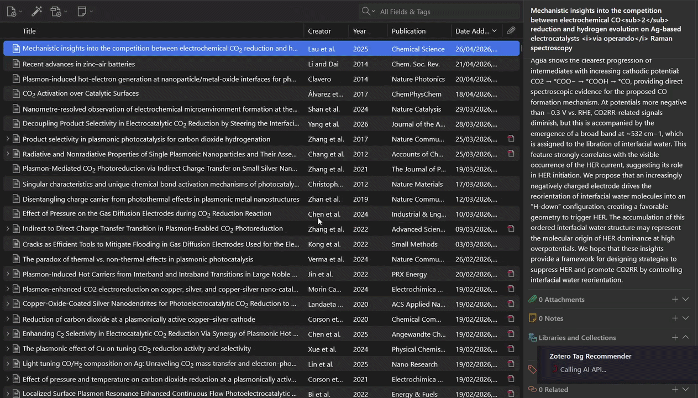
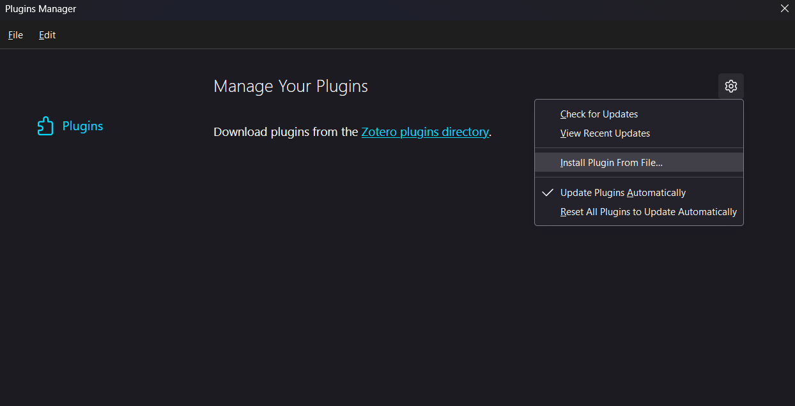
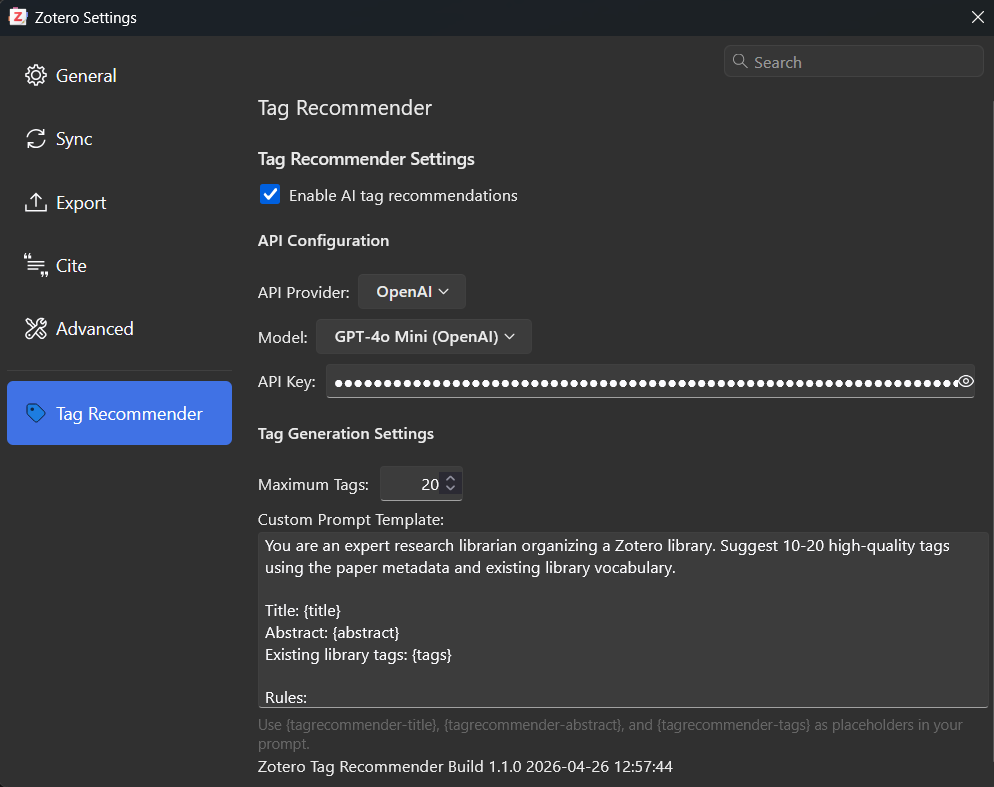
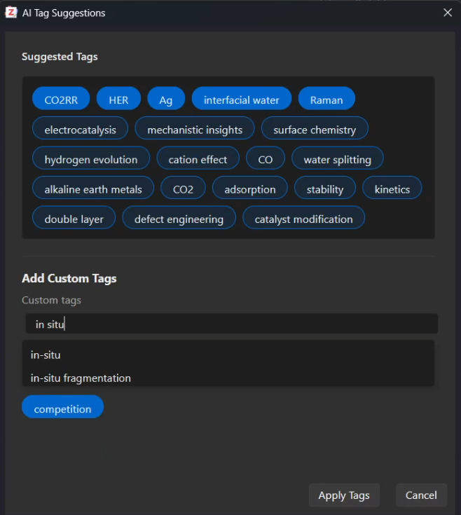

# Zotero Tag Recommender

An AI-powered Zotero plugin that suggests tags from a paper’s title and abstract, aligned with your existing tag vocabulary.

## Quick start

**You only need:**

1. The plugin `.xpi` installed in Zotero [(Latest Release)](https://github.com/kinranlau/zotero_tag_recommender/releases)
2. An API key from [OpenAI](https://platform.openai.com/) or [Anthropic](https://platform.claude.com/)

More details in my Medium article: [Zotero Tag Recommender: Using AI to Suggest Tags for Your Papers](https://medium.com/@kinran_lau/zotero-tag-recommender-using-ai-to-suggest-tags-for-your-papers-a850a0b933ac)

**Cost-efficient model options:**

- `gpt-4o-mini` (recommended, good performance and cheapest)
- `gpt-3.5-turbo`
- `claude-haiku-4-5-20251001`

## Get started

### 1) Install the plugin

1. [Download the latest `.xpi` release package.](https://github.com/kinranlau/zotero_tag_recommender/releases)
2. In Zotero, go to `Tools` -> `Plugins`.
3. Click the gear icon, choose `Install Plugin From File...`, then select the `.xpi`.

### 2) Configure API settings

Open `Edit` -> `Settings` -> `Tag Recommender` and set:

- `API Provider` (`OpenAI` or `Anthropic`; this must match your API key)
- `Model`
- `API Key`
- optional: `Maximum Tags`
- optional: `Custom Prompt`

Default prompt behavior is optimized for:

- aligning suggestions with your established library tags
- returning a clean comma-separated output

### 3) Generate and apply tags

1. Right-click an item and choose `Suggest Tags with AI`.
2. Click suggested tags to toggle selection.
3. You can also type additional tags (comma-separated), e.g. surface chemistry, in-situ, PCET.
4. Click `Apply Tags` to add the selected tags and the manually typed tags.

## Tips for better results

- Keep your library tags clean and consistent; suggestions use that vocabulary.
- Include both title and abstract when possible; titles alone work, but results improve with abstracts.
- Customize the prompt to fit your field and tagging style.
- For budget-friendly usage, `gpt-4o-mini` is a strong default.

## Acknowledgements

- Built on [zotero-plugin-template](https://github.com/windingwind/zotero-plugin-template)
- Developed by Kinran Lau with AI assistance from:
  - GPT-5.3-Codex
  - Claude Sonnet 4.5
